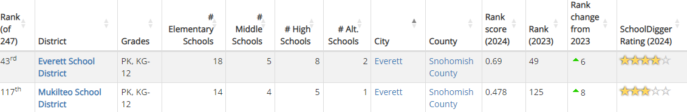
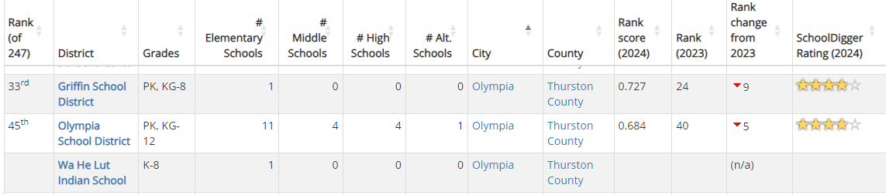
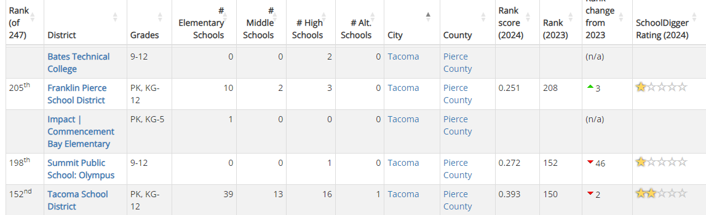

<h1>Washington Move Resources and General Information</h1>

# Contents

- [State Information](#state-information)
  - [Mortgage and Housing](#mortgage-and-housing)
  - [School Information](#school-information)
- [Q And A](#qa)

# State Information

Various links that provide state information
<!-- region state-info-->

## &nbsp;&nbsp;&nbsp; Mortgage and Housing

<ol>

<a href="https://www.wshfc.org/">Washington State Housing Finance Commission</a>

<ol>

Offers a wealth of information for home buyers, home owners and more.  Of particular interest here are potential programs to help with downpayment assistance.

</ol>

<a href="https://www.mrsc.org/">Municipal Research and Services Center(MRSC)</a>

<ol>

Main page for a site that is set up to help local governments with providing legal and policy guidance on various topics.  Great resource for local ordinances, city information and possible contact info.

</ol>

<a href="https://www.mrsc.org/research-tools/washington-city-and-town-profiles/">Washington City and Town Profiles</a>  

<ol>

A subset of the main <a href="https://www.mrsc.org/">MRSC</a> page which contains city/township profile information.  Here, we can find info on specific cities, contact information, local websites, council meetings, laws/codes, and more.

</ol>

<a href="https://www.homeownership-wa.org/">Home Ownership Resource Center</a>

<ol>

Another resource containing information on home buying and home ownership.

</ol>

<h5><a href="#toc">Back to Table of Contents</a></h5>

</ol>

## &nbsp;&nbsp;&nbsp; School Information

<ol>

<a href="https://www.schooldigger.com/">School Digger - Main Page</a>

<ol>

Main page for the school digger website where you can find data regarding schools testing, enrollment data and even financial statistics.  The WA specific district ranking can be found <a href="https://www.schooldigger.com/go/WA/districtrank.aspx">here</a>, which has district rankings out of a total of 247 included.

Everett District Rankings

<ol>

[Everett Schools Info](https://www.schooldigger.com/go/WA/city/Everett/search.aspx)

</ol>

Olympia School District Rankings

<ol>

[Olympia Schools Info](https://www.schooldigger.com/go/WA/city/Olympia/search.aspx)

</ol>

Tacoma School District Rankings

<ol>

[Tacoma Schools Info](https://www.schooldigger.com/go/WA/city/Tacoma/search.aspx)

</ol>

</ol>

<a href="https://reportcard.ospi.k12.wa.us/">Washington Office of Superintendent of Public Instruction</a>

<ol>

State website that has various statistical information regarding schools all over the state of WA.  Of interesting note is how much money is spent per pupil.  Using the amount spent per pupil at Dysart High School as an example, you can see some of the various schools in WA by comparison below.

<ol>Dysart High School - Per Pupil Spend: $10,926</ol>

<ol>

### WA Comparison

<li><a href="https://reportcard.ospi.k12.wa.us/ReportCard/ViewSchoolOrDistrict/102960">Avanti High School</a> 
Spend: $14,278 
Difference: 30.67%</li>

<li><a href="https://reportcard.ospi.k12.wa.us/ReportCard/ViewSchoolOrDistrict/102969">Olympia High School</a> 
Spend: $15,986 
Difference: 46.31%</li>

<li><a href="https://reportcard.ospi.k12.wa.us/ReportCard/ViewSchoolOrDistrict/102976">Capital High School</a> 
Spend: $16,787 
Difference: 53.64%</li>

</ol>

</ol>

</ol>

<h5><a href="#toc">Back to Table of Contents</a></h5>

<!-- endregion state-info-->

# Q&A

Questions we've had and the associated answers:

<h5><a href="#toc">Back to Table of Contents</a></h5>
